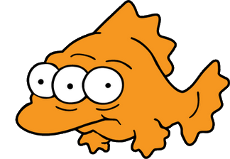

# Blinky



This is a fisheye addon for Quake (software mode).  It fully explores the
potential of panoramic gaming.  With it, you can achieve hyper-wide FOVs (up to
360º) never before seen in games.

It is an evolution of the original [Fisheye
Quake](http://strlen.com/gfxengine/fisheyequake/) by Wouter van Oortmerssen. It
has been heavily modified with new lenses (via Lua scripts) and has been ported
to the [TyrQuake engine](http://disenchant.net/tyrquake/) for use in modern
__Windows, Mac, and Linux__.

## How does it work?

View construction happens in two stages:

1. Capture surrounding pixels with multiple camera shots. (via __Globe__ script)
1. Stitch the shots together on the screen to get a hyper-wide FOV. (via __Lens__ script)

Your view can be customized by swapping each script out for another; choose
from several presets or even create your own.

__NOTE__: See the beginning of `NQ/fisheye.c` for extensive documentation and
diagrams describing the fisheye process in detail.

## Setup

1. Install [Lua](http://www.lua.org/)
1. Install [SDL2 Dev Libs](https://www.libsdl.org/download-2.0.php)
1. Build the engine:

    ```
    $ ./build.sh
    ```

1. Run the game.  You should see Quake in 180º using the Panini projection:

    ```
    $ ./play.sh
    ```

## Commands

```
fisheye <0|1>     : enable/disable fisheye mode
f_help            : show quick start options
f_globe <name>    : choose a globe (affects picture quality and render speed)
f_lens <name>     : choose a lens (affects the shape of your view)
f_fov <degrees>   : zoom to a horizontal FOV
f_vfov <degrees>  : zoom to a vertical FOV
f_cover           : zoom in until screen is covered (some parts may be hidden)
f_contain         : zoom out until screen contains the entire image (if possible)
f_rubix           : display colored grid for each rendered view in the globe
f_saveglobe       : take screenshots of each globe face (environment map)
```

## Code Navigation

__NOTE__: See the beginning of `fisheye.c` for extensive documentation and
diagrams describing the fisheye process in detail.

If you wish to see the engine modifications that made this possible, see the
[engine patch](engine/fisheye.patch), generated by:

```
git diff 23119f4eb2ac6b5cef3e1ebfc785189b011aae26.. NQ common include Makefile
```

The meat of the work is done by the following files, which are completely
new additions to the engine:

- engine/NQ/fisheye.c
- engine/include/fisheye.h
- lua/lenses/*.lua
- lua/globes/*.lua

